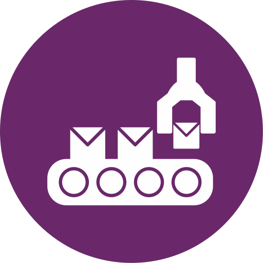

    <h1>Learning Assembly Language</h1>

 

    
Eu sou velho!

    

<h3> O que é a linguagem Assembly?</h3>

 É uma linguagem de programação de baixo nível que utiliza símbolos e mnemônicos pra representar diretamente as instruções do código de máquina de um processador.

> Mnemônicos - Técnica utilizada para facilitar a memorização de informações complexas, tais como: listas, fórmulas ou sequências. 

---

 

### Conceitos importantes:

<b>Como funciona o Assembly?</b>

 

O Assembly diferentes de outras linguagens de programação, utiliza mais da elétrica e binários.

 

> Computador - A máquina de processar dados
>
> Instruções - Algo que o processador consiga realizar
>
> Programação Baixo Nível - Escrever instruções diretamente pelo processador ou hardware
>
> Em Assembly, níveis de tensão representam valores
>
> E sua programação é representado em valor binário (0 - Desligado ou False | 1 - Ligado ou True)

